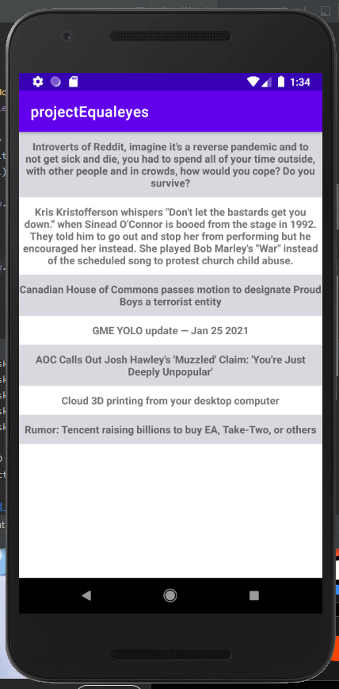

# Project to get all reddit titles and put it into app :clipboard:

## Made in Android Studio with java

### Using library jsoup :books:

### SCREENSHOT :iphone:
<table>
  <tr>
    <td>Using "StringBuilder"</td>
     <td>Using "RecyclerView"</td>
  </tr>
  <tr>
    <td></td>
    <td></td>
  </tr>
</table>
